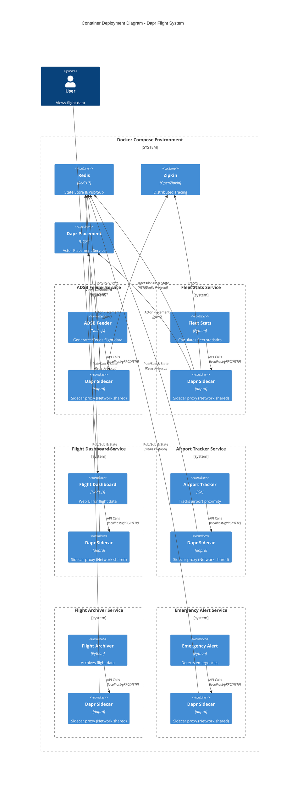

# Container Deployment Diagram

This document contains a C4 Container diagram illustrating the deployment architecture of the Dapr Flight System using Docker Compose.

## Mermaid C4 Container Diagram



## PlantUML C4 Container Diagram (Alternative)

For use with PlantUML servers or extensions.

```plantuml
@startuml
!include https://raw.githubusercontent.com/plantuml-stdlib/C4-PlantUML/master/C4_Container.puml

LAYOUT_WITH_LEGEND()

title Container Deployment Diagram - Dapr Flight System

Person(user, "User", "Views flight data")

System_Boundary(docker_env, "Docker Compose Environment") {
    
    Container(redis, "Redis", "Redis 7", "State Store & Pub/Sub")
    Container(zipkin, "Zipkin", "OpenZipkin", "Distributed Tracing")
    Container(placement, "Dapr Placement", "Dapr", "Actor Placement Service")

    Container_Boundary(adsb_group, "ADSB Feeder Service") {
        Container(adsb, "ADSB Feeder", "Node.js", "Generates flight data")
        Container(adsb_dapr, "Dapr Sidecar", "daprd", "Sidecar proxy")
    }

    Container_Boundary(fleet_group, "Fleet Stats Service") {
        Container(fleet, "Fleet Stats", "Python", "Calculates fleet statistics")
        Container(fleet_dapr, "Dapr Sidecar", "daprd", "Sidecar proxy")
    }

    Container_Boundary(dashboard_group, "Flight Dashboard Service") {
        Container(dash, "Flight Dashboard", "Node.js", "Web UI for flight data")
        Container(dash_dapr, "Dapr Sidecar", "daprd", "Sidecar proxy")
    }
    
    Container_Boundary(tracker_group, "Airport Tracker Service") {
        Container(tracker, "Airport Tracker", "Go", "Tracks airport proximity")
        Container(tracker_dapr, "Dapr Sidecar", "daprd", "Sidecar proxy")
    }

    Container_Boundary(archiver_group, "Flight Archiver Service") {
        Container(archiver, "Flight Archiver", "Python", "Archives flight data")
        Container(archiver_dapr, "Dapr Sidecar", "daprd", "Sidecar proxy")
    }

    Container_Boundary(alert_group, "Emergency Alert Service") {
        Container(alert, "Emergency Alert", "Python", "Detects emergencies")
        Container(alert_dapr, "Dapr Sidecar", "daprd", "Sidecar proxy")
    }
}

Rel(user, dash, "Views Dashboard", "HTTP/3002")

Rel(adsb, adsb_dapr, "API Calls", "localhost")
Rel(fleet, fleet_dapr, "API Calls", "localhost")
Rel(dash, dash_dapr, "API Calls", "localhost")
Rel(tracker, tracker_dapr, "API Calls", "localhost")
Rel(archiver, archiver_dapr, "API Calls", "localhost")
Rel(alert, alert_dapr, "API Calls", "localhost")

Rel(adsb_dapr, redis, "Pub/Sub & State", "Redis Protocol")
Rel(fleet_dapr, redis, "Pub/Sub & State", "Redis Protocol")
Rel(dash_dapr, redis, "Pub/Sub & State", "Redis Protocol")
Rel(tracker_dapr, redis, "Pub/Sub & State", "Redis Protocol")
Rel(archiver_dapr, redis, "Pub/Sub & State", "Redis Protocol")
Rel(alert_dapr, redis, "Pub/Sub & State", "Redis Protocol")

@enduml
```
